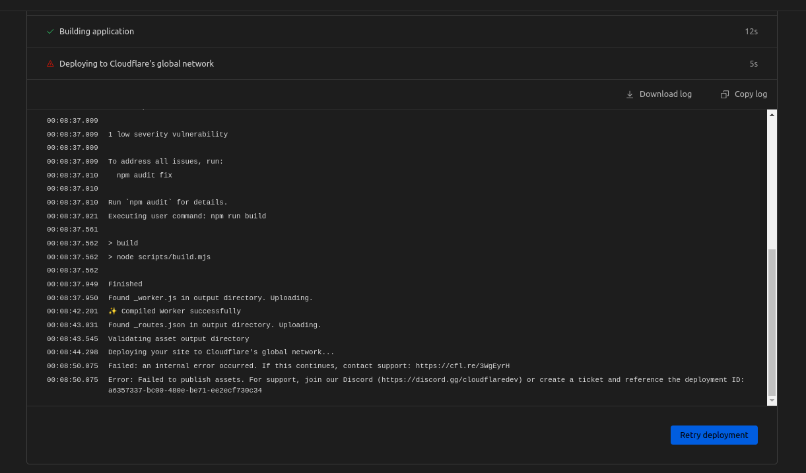

# Cloudflare Pages _worker.js 25MiB issue reproduction

Minimal reproduction showing that trying to upload a Pages application
which output is larger than 25MiB causes an internal error which doesn't
provide much help to end users

To use this reproduction simply clone this repo and link it to a Pages
project via the Pages git integration, the CI deployment should error with the following:

